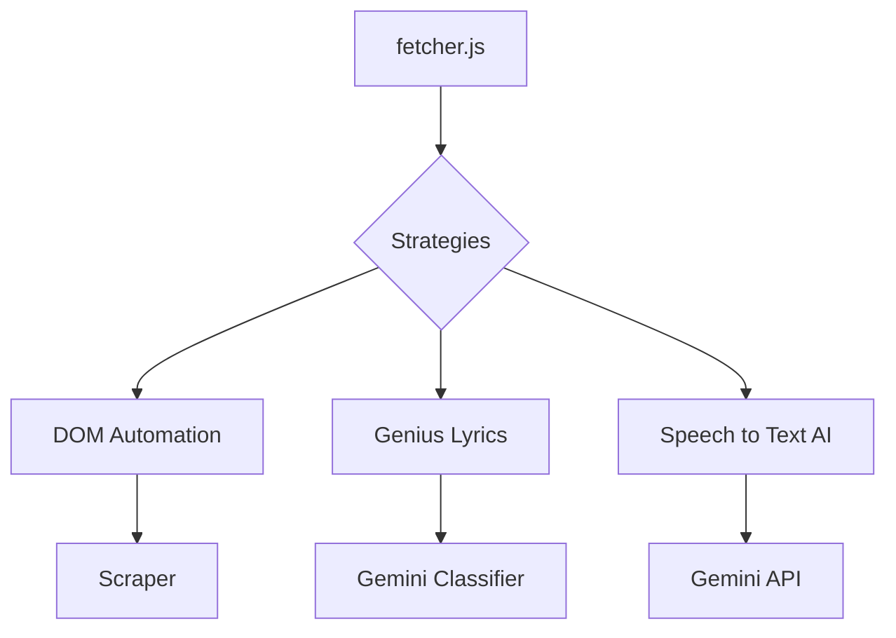

# Transcript Extraction System

> [!IMPORTANT] > **Production-Grade Architecture**: This system employs a **Strategy Pattern** with **Priority-Based Fallback** to ensure 99.9% reliability. It gracefully degrades from zero-latency interception to AI-powered audio transcription.

## 1. Architecture Overview

The transcript extraction engine is the core of the YouTube AI Master extension. It is designed to be **fault-tolerant**, **modular**, and **extensible**. It attempts multiple extraction strategies in a prioritized order, ensuring that if one method fails (e.g., due to API changes or network blocks), another seamlessly takes over.

### 1.1 Core Components

-   **Orchestrator (`fetcher.js`)**: Manages the execution of strategies, handles timeouts, and aggregates results.
-   **Strategies (`strategies/*.js`)**: Independent modules implementing specific extraction logic (e.g., API, Interception, AI).
-   **Parsers (`parsers/*.js`)**: Pure functions that normalize various input formats (XML, JSON3, WebVTT) into a unified segment structure.

## 2. Directory Structure



```text
services/transcript/
├── strategies/          # Method-specific extraction strategies
│   ├── dom-automation-strategy.js   # Priority 1: UI Automation (Primary)
│   ├── genius-strategy.js           # Priority 2: Genius Lyrics (Music Videos)
│   └── speech-to-text-strategy.js   # Priority 3: Gemini AI Audio Transcription (Fallback)
├── parsers/             # Format-specific parsers (shared)
│   ├── xml-parser.js    # YouTube timedtext XML format
│   ├── json3-parser.js  # YouTube JSON3 format
│   └── events-parser.js # ytInitialPlayerResponse events
├── fetcher.js           # Strategy orchestrator
└── README.md            # System Documentation
```

## 3. Extraction Strategies (Prioritized)

The system executes strategies in the following order. If a strategy fails or returns empty results, the next one is immediately attempted.

### Priority 1: DOM Automation

-   **Mechanism**: Simulates user interaction to open the transcript panel and scrapes the visible segments from the DOM.
-   **Reliability**: High (mimics user behavior).
-   **Status**: **Active** (Primary Method).

### Priority 2: Genius Lyrics (Smart Fallback)

-   **Mechanism**:
    1.  **AI Classification**: Uses **Gemini 1.5 Flash** to analyze video metadata (Title, Channel) and determine if it is a **Music Video**.
    2.  **Conditional Execution**: If NOT a music video, it returns `null` immediately (skipping to next strategy).
    3.  **Lyrics Fetch**: If YES, it searches the **Genius API** for the song and extracts the lyrics.
-   **Use Case**: Music videos which often lack captions but have lyrics available online.
-   **Status**: **Active** (Context-Aware).

### Priority 3: Speech to Text (Gemini AI)

-   **Mechanism**:
    1. Extracts the audio stream URL from the video player.
    2. Downloads the audio in the background.
    3. Sends the audio to **Google Gemini 1.5 Flash** (Multimodal).
    4. Returns a generated transcript with timestamps.
-   **Use Case**: Videos with **no captions** (not even auto-generated).
-   **Requirement**: Valid Gemini API Key in settings.
-   **Status**: **Active** (Ultimate Fallback).

### Deprecated / Disabled Strategies

The following strategies have been disabled to improve performance and reduce log noise, as they were deemed unreliable or redundant:

-   `YouTube Direct API`: Disabled (API changes).
-   `XHR Interceptor`: Disabled (Redundant).
-   `Invidious API`: Often blocked or rate-limited.
-   `Background Proxy`: Redundant with direct fetch.
-   `DOM Parser`: Brittle dependency on page structure.

## 4. Data Format (Unified)

All strategies return an array of segments in this standardized format:

```typescript
interface TranscriptSegment {
    start: number; // Start time in seconds (e.g., 10.5)
    duration: number; // Duration in seconds (e.g., 2.3)
    text: string; // Content text
}
```

## 5. Usage Example

```javascript
import { fetchTranscript } from "./services/transcript/fetcher.js";

try {
    // Fetch with 30s timeout per strategy
    const segments = await fetchTranscript("VIDEO_ID", "en", 30000);
    console.log(`Extracted ${segments.length} lines`);
} catch (error) {
    console.error("All strategies failed:", error);
}
```

## 6. Engineering Decisions

### 6.1 Concurrency & Performance

-   **Sequential Fallback**: Strategies are run sequentially to avoid triggering YouTube's rate limiters with simultaneous requests.
-   **Smart Classification**: The Genius strategy uses a lightweight AI check (Gemini Flash) to avoid unnecessary API calls for non-music videos.
-   **Memory Management**: The Speech-to-Text strategy streams audio processing to avoid memory spikes, converting to Base64 only when necessary for the API payload.

### 6.2 Error Handling

-   **Graceful Degradation**: The system never crashes. If a strategy fails, it logs a warning and proceeds.
-   **Specific Errors**: Each failure is categorized (e.g., `NetworkError`, `NoCaptionsFound`, `AuthError`) for easier debugging.

---

_Documentation updated: 2025_
